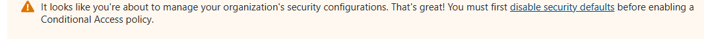
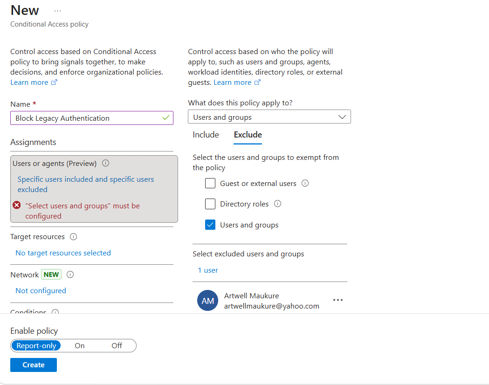

# 🔐 Module 02: Conditional Access & Geographic Hardening

## 📖 Overview
This module demonstrates the implementation of a **Zero-Trust network perimeter**. I transitioned the tenant from "Security Defaults" to granular policies that evaluate user risk based on location and role status.

## 🛠️ Implementation Steps

### 1. Disabling Security Defaults
Before creating custom policies, I disabled global Security Defaults.
* **Evidence:** 

### 2. Geographic Hardening 
I defined "Poland" as a geographic perimeter to manage trusted vs. untrusted zones.
* **Evidence:** 

### 3. Policy Configuration
I configured the **"Block Legacy Authentication"** policy with specific exclusions to ensure administrative resilience.
* **Exclusion Logic:** Excluded the "Poland" location and my "Break-Glass" account.
* **Evidence:** 
* **Evidence:** 

---

## 🧪 Testing & Validation

### Scenario A: Security Block (403 Error)
During testing, I validated that when a PIM session expires, the account is correctly blocked. This proves the "Deny-by-Default" logic is functioning.
* **Evidence:** 

### Scenario B: MFA Pivot
I updated the policy to trigger an **MFA Challenge** instead of a hard block. The system successfully validates the user via Number Matching.
* **Evidence:** 

---

## 🧠 Technical Logic
The Conditional Access engine evaluates your session in real-time. When you activate a role via **PIM**, you are granted the "Admin" status; when that session expires, the policy engine re-evaluates your identity and applies the restriction. This 403 error was a successful verification of the policy's **least privilege** enforcement.
